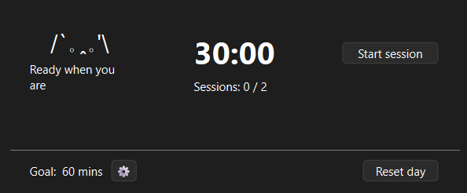

# Focus Cat

Focus Cat is a tiny, friendly productivity timer that helps you work in focused sessions that adapt to how you feel today, by first measuring your attention span.



## How it works
Start the timer and start working. When you feel your attention waver -- could be after 2h or 15 mins, doesn't matter -- stop it. This will set your session length for the day (that time will already count towards your goal!).

Why? Some days we're fresh and alert, others we need lots of breaks. This technique helps focus in a way that doesn't exhaust you nor cuts you short in the middle of a flow.

## Requirements
- Python 3.10+ (https://www.python.org/downloads/)
- PySide6 (`pip install PySide6`)


## Run Focus Cat
```
python main.py
```

## Packaging

### On Windows
```
pip install pyinstaller
pyinstaller FocusCat.spec
```

Find `FocusCat.exe` in `dist/`

### On Linux
```
pip install pyinstaller
sudo apt install appimagetool
pyinstaller FocusCat.spec
chmod +x dist/main.AppImage
```

Find `main.AppImage` in `dist/`

## License
MIT

## Credits:
Sound Effect by <a href="https://pixabay.com/users/floraphonic-38928062/?utm_source=link-attribution&utm_medium=referral&utm_campaign=music&utm_content=185155">floraphonic</a> from <a href="https://pixabay.com//?utm_source=link-attribution&utm_medium=referral&utm_campaign=music&utm_content=185155">Pixabay</a>
Developed using Microsoft Copilot


